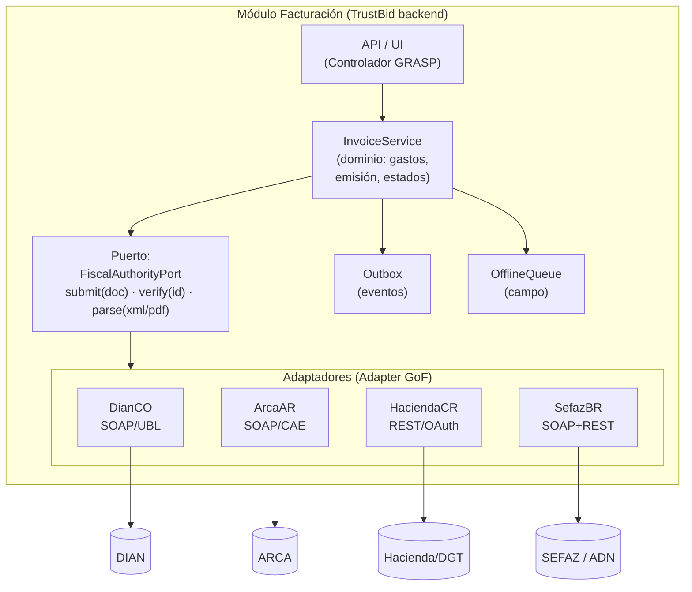
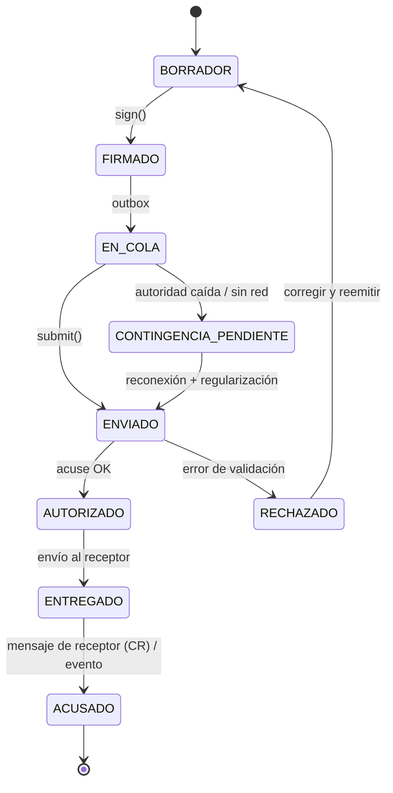

# Arquitectura de integración multi-país para TrustBid

Diseño basado en los patrones de la skill `arquitectura-de-software` (GRASP, GoF,
patrones distribuidos). El problema central: 4 autoridades fiscales con protocolos,
formatos, identificadores y ciclos de validación distintos, consumidos por un mismo
pipeline de gastos/facturación de TrustBid, con operación en campo sin conectividad.

## Decisión de estilo: monolito modular + puertos y adaptadores

No se necesitan microservicios por país (mismo equipo, mismo ciclo de vida). Se
recomienda un **módulo de facturación** dentro del backend de TrustBid con arquitectura
**hexagonal (Ports & Adapters)**: el dominio define puertos estables y cada país es un
adaptador intercambiable. Esto aplica GRASP *Indirección* + *Variaciones Protegidas*:
lo que cambia (normativa por país) queda detrás de una interfaz que no cambia.

## Diagrama C4 — Nivel de componentes



## Patrones aplicados y por qué

| Patrón | Dónde | Problema que resuelve |
|---|---|---|
| **Adapter (GoF)** | Un adaptador por autoridad (DIAN, ARCA, Hacienda, SEFAZ) | Protocolos heterogéneos (SOAP WCF, SOAP+WSAA, REST OAuth2, SOAP+REST) tras un puerto único |
| **Strategy (GoF)** | Cálculo de identificador único y de impuestos | CUFE SHA-384 vs CAE vs clave-50 vs chave-44/Módulo 11; IVA vs alícuotas vs IBS/CBS — se selecciona por país en runtime |
| **Abstract Factory (GoF)** | `FiscalToolkitFactory.for(country)` | Crear familia coherente: builder de documento + firmador + estrategia de ID + verificador. Evita `if country ==` regado (anti-patrón Shotgun Surgery) |
| **Builder (GoF)** | Construcción del XML (UBL 2.1, WSFE payload, XML 4.4, layout 4.00) | Documentos con decenas de campos condicionales y validaciones de esquema |
| **Circuit Breaker** | Frente a cada autoridad fiscal | DIAN/ARCA/SEFAZ tienen caídas; el breaker abre y deriva a modo contingencia (CAEA, Situación 3, SVC/EPEC) en vez de reintentar en cascada |
| **Outbox** | Emisión y reporte de comprobantes | La factura se persiste y el envío a la autoridad se hace desde el outbox — nunca "dual write" (guardar local + llamar API en la misma transacción). Garantiza reintentos idempotentes |
| **Saga (coreografía corta)** | Ciclo emisión → autorización → entrega al cliente → acuse | En CR la validación es asíncrona (polling) y en CO hay que armar el AttachedDocument tras el ApplicationResponse; cada paso tiene compensación (nota de crédito / anulación) |
| **State (GoF)** | Ciclo de vida del comprobante | Estados: `BORRADOR → FIRMADO → EN_COLA → ENVIADO → AUTORIZADO / RECHAZADO → ENTREGADO → ACUSADO` (+ `CONTINGENCIA_PENDIENTE`). Las transiciones válidas difieren por país |
| **Facade (GoF)** | `InvoicingFacade` hacia el resto de TrustBid | El pipeline de gastos no conoce UBL ni SOAP; pide `validateExpense(doc)` y recibe un veredicto |

## Ciclo de vida del comprobante (patrón State)

Las transiciones válidas difieren por país (p. ej. CR pasa por polling asíncrono; CO
arma el AttachedDocument tras el acuse). El diagrama muestra el flujo canónico.



## Contratos de los puertos (interfaz estable)

```
FiscalAuthorityPort
  submit(document: FiscalDocument) -> SubmissionResult   # sync (CO/AR/BR) o async con polling (CR)
  poll(submissionId) -> AuthorizationStatus              # solo CR y NFS-e BR
  verify(uniqueId: string) -> VerificationResult         # CUFE / CAE+QR / clave50 / chave44
  parse(raw: bytes, kind: XML|PDF) -> ParsedInvoice      # extrae campos + identificador

SignerPort
  sign(xml) -> signedXml     # XAdES-EPES (CO/CR), CMS-PKCS#7 (AR/WSAA), XMLDSig ICP (BR)

OfflineAuthorizationPort   # solo países con credencial pre-aprobada
  prefetch(period) -> OfflineCredential   # CAEA quincenal (AR); n/a CO; implícito CR/BR
```

## Multi-tenancy y credenciales

- TrustBid opera para múltiples organizaciones (tenants) → **certificados y credenciales
  por tenant y por país**: cert ONAC + clave técnica (CO), cert X.509 ARCA + PV (AR),
  .p12 + password API (CR), e-CNPJ A1 (BR).
- Almacenar en un KMS/secret manager con aislamiento por tenant; nunca en la BD de
  aplicación. Rotación: A1 brasileño vence a los 12 meses; tickets WSAA y tokens
  OAuth CR duran 12 h → cache con renovación anticipada.
- Numeración (consecutivos, PV, sucursal/terminal) es **estado crítico por tenant**:
  asignación exclusiva por dispositivo (ver flujos-operativos.md) y secuencias
  transaccionales en BD, jamás en memoria.

## Anti-patrones a vigilar (de `anti_patrones.md`)

- **Dual Write sin Outbox**: guardar la factura y llamar a la autoridad en la misma
  transacción → inconsistencia cuando la API falla a mitad. Usar Outbox siempre.
- **God Object**: un `InvoiceManager` que firma, construye XML, llama SOAP y decide
  impuestos. Separar por los puertos de arriba.
- **Golden Hammer**: no forzar REST donde el país solo habla SOAP (CO/AR) ni replicar
  el modelo UBL colombiano en los otros tres países.
- **Distributed Monolith**: si algún día se separan servicios por país, que no
  compartan la BD de numeración.

## Observabilidad mínima

- Trazar cada documento con `correlation_id` = identificador fiscal (CUFE/CAE/clave/chave).
- Métricas por adaptador: tasa de rechazo por código de error de la autoridad, latencia
  de autorización, profundidad de la cola offline, comprobantes en contingencia
  pendientes de regularizar y su deadline legal (8 días AR, 48 h CR, 24/168 h BR).
- Alertar ANTES del vencimiento del plazo legal de regularización — el incumplimiento
  tiene sanciones (suspensión de CAEA en AR, multas por evasión en BR).
