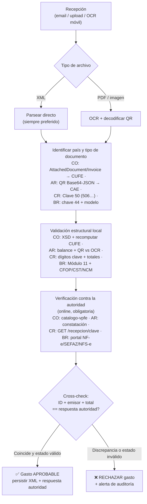
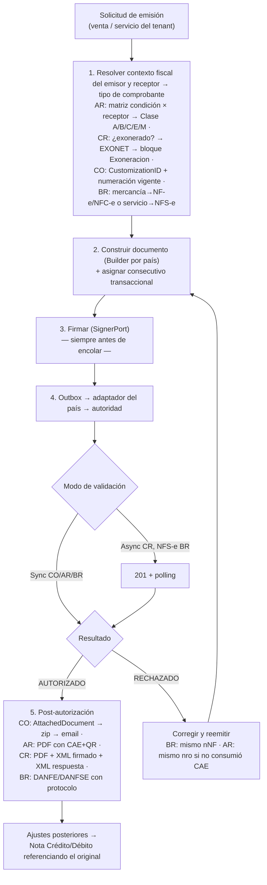
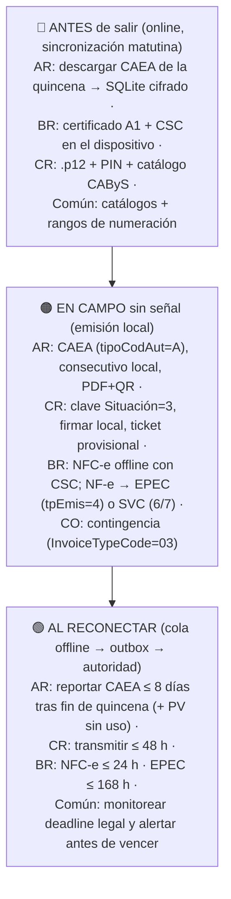
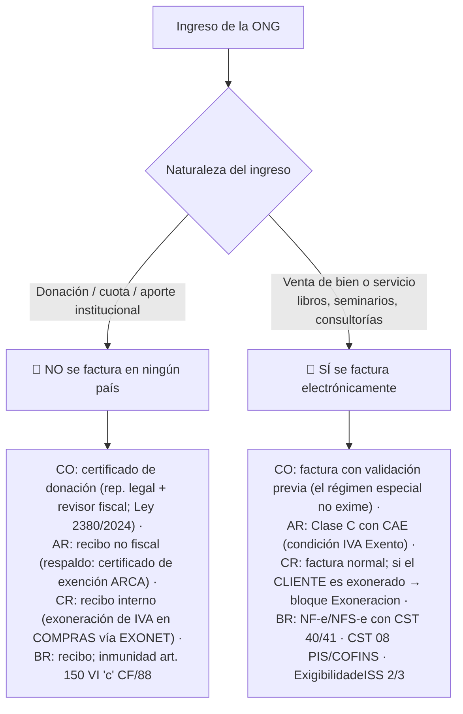

# Flujos operativos TrustBid — multi-país

Cuatro flujos transversales. Los detalles normativos de cada paso están en la
referencia del país correspondiente.

## Flujo 1 — Validación de un gasto entrante (parser + verificador)

Objetivo: impedir que una factura falsa o alterada se apruebe como gasto.

Reglas duras:
- Un tiquete CR (tipo 04) o una NFC-e brasileña de consumidor **no respaldan crédito
  fiscal** — marcarlos como no deducibles aunque sean auténticos.
- En CR el gasto solo es deducible si además se emitió el **Mensaje de Receptor**
  (tipo 05/06/07) dentro del plazo — TrustBid debe generarlo, no solo verificar.
- En CO, si el proveedor es informal (sin factura), el flujo correcto es emitir
  **Documento Soporte electrónico**, no aprobar el recibo a secas.

## Flujo 2 — Emisión de factura propia

## Flujo 3 — Operación en campo con conectividad intermitente

Principio común: **un dispositivo = una identidad de numeración exclusiva** (PV en AR,
Sucursal+Terminal en CR, série en BR, prefijo/rango en CO). Nunca compartir secuencias
entre terminales offline.

### Traslado de materiales (cuadrillas)
| País | Documento de tránsito |
|---|---|
| AR | Remito Clase R (CAI); COT en provincias con control (ARBA ≥ $7.220.557 o ≥ 4.500 kg) |
| BR | NF-e de remesa (CFOP 5.554/6.554 o 5.949/6.949, CST 40/41) + MDF-e con encerramento al llegar |
| CR | No hay documento fiscal de tránsito interno — portar facturas de compra + albarán interno |
| CO | Sin guía fiscal específica de tránsito interno para este caso |

### Tributos territoriales a registrar por gasto/servicio
- AR: provincia de ejecución (sustento territorial) → Convenio Multilateral / SIFERE.
- BR: estado destino → DIFAL (fórmula base dupla); municipio del tomador → ISS vía ADN.
- CR: cantón → posibles patentes municipales si la operación se vuelve permanente.

## Flujo 4 — ONG / entidades sin fines de lucro

Clasificar SIEMPRE el ingreso antes de decidir si se factura:

Egresos de la ONG en campo (proveedores informales):
- CO: generar **Documento Soporte electrónico** por cada compra a no obligados
  (jornaleros, transporte rural) — vía OCR del recibo + transmisión a la DIAN.
- AR/CR/BR: exigir comprobante fiscal del proveedor; sin él, el gasto no es deducible y
  debe marcarse en TrustBid como "sin soporte fiscal" para el reporte al donante.
